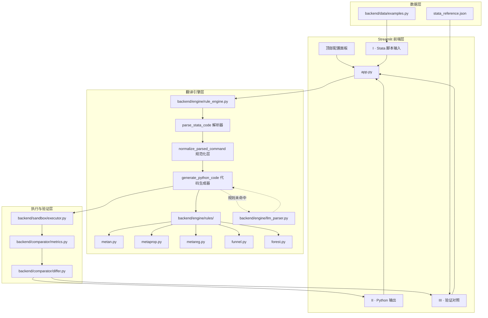
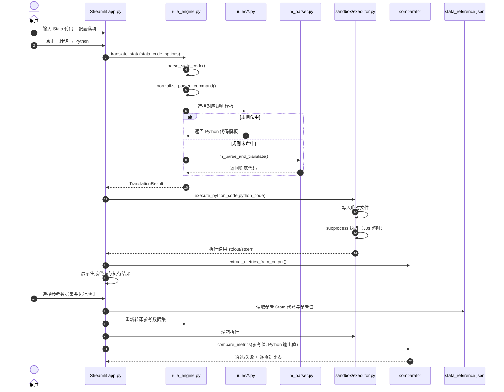
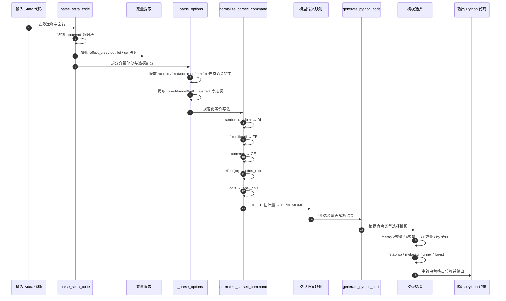

# MetaFlow 项目汇报材料

> Stata Meta-Analysis → Python 翻译器（规则匹配优先 + LLM 兜底）

---

## 一、网页功能介绍

MetaFlow 是一个面向医学/循证医学研究者的在线工具，核心目标是把 Stata 的 meta 分析命令一键转译为可执行的 Python 代码，并验证其计算结果与 Stata 官方输出的一致性。

### 1.1 当前界面布局

页面采用**学术期刊风格**的垂直三栏布局：

| 区域 | 名称 | 功能 |
|------|------|------|
| 顶部 | 配置面板 | 分析模型、τ² 估计量、置信水平、eform、转译模式、文件上传、内置示例 |
| I | Stata · 脚本输入 | 输入 Stata meta 命令，支持 `input/end` 内联数据 |
| II | Python · 输出 | 生成代码、执行输出、转译日志三 Tab 展示 |
| III | 验证对照 | 选择 Stata 参考数据集，逐项对比效应量、CI、I²、Q、τ² 等指标 |

### 1.2 核心交互流程

1. 用户在 **I 区**输入或加载 Stata 代码；
2. 顶部配置面板选择模型与统计选项；
3. 点击 **「🔄 转译 → Python」**；
4. 后台规则引擎生成 Python 代码；
5. 沙箱执行并返回结果到 **II 区**；
6. 用户可在 **III 区**与 Stata 参考值做精度验证。

---

## 二、项目迭代与优化历程

### 2.1 第一阶段：项目整理与 Streamlit Cloud 部署

- 清理杂乱文件，建立可上传的 Streamlit 包结构；
- 确定以 `app.py` 为唯一入口，删除 FastAPI/React 分离架构；
- 配置 `requirements.txt`、`.streamlit/config.toml`、`.gitignore`。

### 2.2 第二阶段：核心翻译引擎建设

- 构建 `backend/engine/rule_engine.py` 规则引擎；
- 支持 `metan`、`metaprop`、`metareg`、`funnel`、`forest`、`meta` 等主命令；
- 实现 7 种 τ² 估计量（DL / REML / ML / Hedges / SJ / HS / EB）和 3 种模型（RE / FE / CE）；
- 支持 2 变量（ES+SE）、4 变量（ES+LCI+UCI）、6 变量（原始均值/标准差）等多种数据格式；
- 引入 `backend/sandbox/executor.py` 子进程沙箱执行，30 秒超时隔离。

### 2.3 第三阶段：规范化层与精度优化

- 增加 `normalize_parsed_command` 规范化层，统一 Stata 命令的各种等价写法：
  - `random` / `randomi` → `DL`
  - `fixed` / `fixedi` → `FE`
  - `common` → `CE`
  - `effect(or)` → `odds_ratio`
  - `lcols(...)` → `label_cols`
- 修正 Mantel-Haenszel OR 方差公式括号问题；
- 6 变量原始数据格式直接计算 MD 与 SE，避免由 CI 反推带来的精度损失；
- 建立 `stata_reference.json` 参考数据集与验证流程。

### 2.4 第四阶段：UI 迭代优化

| 阶段 | 设计风格 | 关键变化 |
|------|----------|----------|
| v1 | 基础 Streamlit | 左侧边栏配置，左右两栏输入输出 |
| v2 | SaaS 科技感 | 深蓝渐变背景、霓虹青紫、玻璃态卡片、顶部横向配置栏 |
| v3 | 极简宽松布局 | 顶部配置栏改为两排四列宽松排版，主内容改为垂直三栏 |
| v4 | 学术期刊风 | 米白纸纹背景、藏蓝+金色、Crimson Text 衬线字体、章节编号 I/II/III |

### 2.5 当前状态

- 入口：`app.py`（Streamlit）
- 部署目标：Streamlit Cloud
- 翻译引擎：规则优先 + LLM 兜底
- 验证机制：与 Stata 参考值对比，容差 1%

---

## 三、系统架构图

---

## 四、核心时序图

### 4.1 Stata → Python 转译与执行主流程

### 4.2 规则引擎内部处理流程

---

## 五、技术栈

| 层级 | 技术 |
|------|------|
| 前端 UI | Streamlit + 自定义 CSS（学术期刊风格） |
| 后端引擎 | Python 3.9+ |
| 科学计算 | numpy、scipy、statsmodels、pandas、matplotlib |
| 规则引擎 | 结构化字典 + 模板字符串替换 |
| LLM 兜底 | backend/engine/llm_parser.py（可选） |
| 沙箱执行 | subprocess + tempfile + 30s 超时 |
| 验证对比 | 自定义 metrics/differ 模块 |
| 部署 | Streamlit Cloud |

---

## 六、关键设计亮点

1. **规则优先，LLM 兜底**：80% 常见 Stata meta 命令通过结构化规则直接映射，保证可解释性与稳定性；未命中时启用 LLM。
2. **规范化层**：统一 Stata 命令的多种等价写法，避免规则膨胀。
3. **精度优先**：6 变量原始数据直接计算，避免 CI 反推 SE 的精度损失。
4. **沙箱隔离**：生成代码在独立子进程执行，30 秒超时，限制输出大小。
5. **可验证性**：内置 Stata 参考数据集，逐项对比 effect size、CI、I²、Q、τ²，容差 1%。
6. **学术风格 UI**：米白纸纹、藏蓝主色、金色点缀、衬线字体，符合学术场景审美。

---

## 七、文件职责总览

| 文件 | 职责 |
|------|------|
| `app.py` | Streamlit 页面渲染、状态管理、CSS 主题注入 |
| `backend/engine/rule_engine.py` | Stata 解析、规范化、代码生成主入口 |
| `backend/engine/rules/*.py` | 各命令的算法模板与实现 |
| `backend/engine/llm_parser.py` | 规则未命中时的 LLM 兜底解析 |
| `backend/sandbox/executor.py` | 临时文件 + subprocess 沙箱执行 |
| `backend/sandbox/security.py` | 代码安全检测 |
| `backend/comparator/metrics.py` | 从 stdout 提取 pooled_effect / CI / I² / Q / τ² 等 |
| `backend/comparator/differ.py` | 相对差计算与通过/失败判定 |
| `backend/data/examples.py` | 内置 Stata 示例 |
| `stata_reference.json` | Stata 官方参考数据集与参考值 |
| `.streamlit/config.toml` | Streamlit 主题配置 |
| `requirements.txt` | 依赖清单 |
