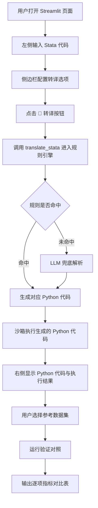
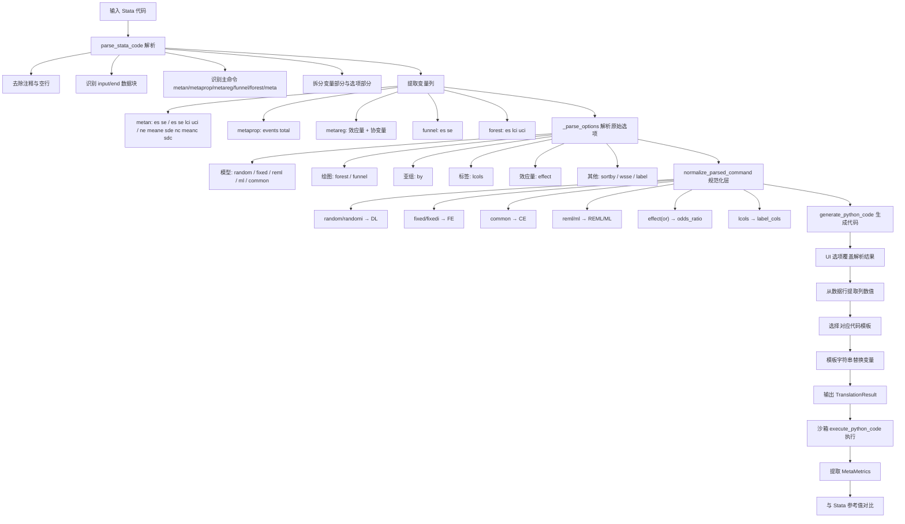
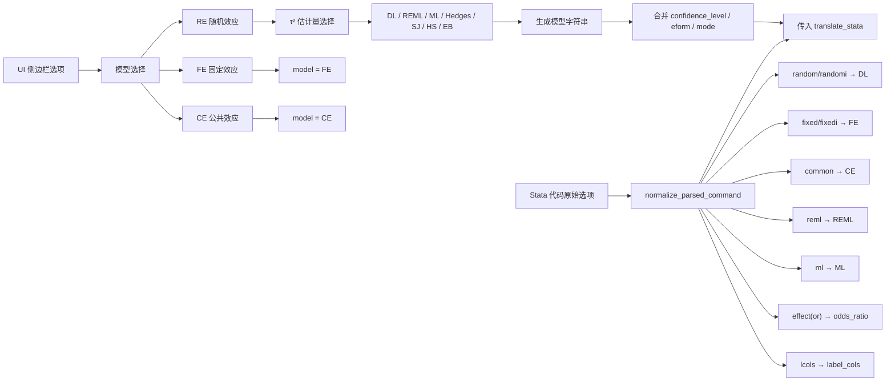
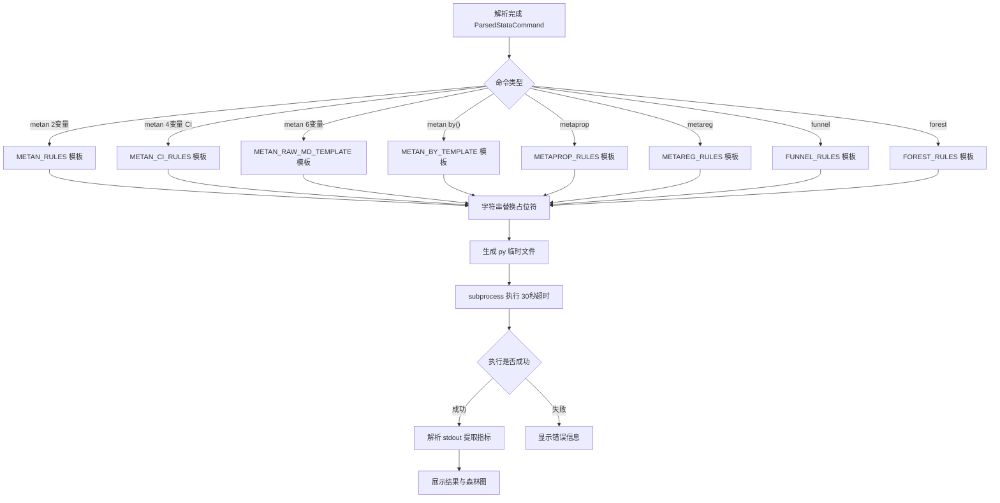
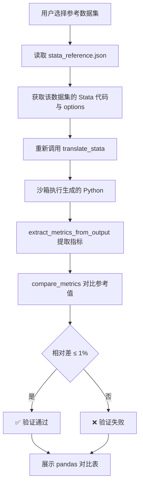

# Stata Meta → Python 翻译器 业务流程图

本文档使用业务流程图描述项目从用户输入到结果输出的完整流程，重点说明 **Stata 代码如何被转换为 Python 代码**。

---

## 一、总体业务流程图



---

## 二、Stata → Python 转译核心流程图

这是本项目最核心的业务流程，由 `backend/engine/rule_engine.py` 完成。



---

## 三、选项与模型映射子流程



### 规范化映射表

| 类型 | 原始写法 | 规范值 |
|------|----------|--------|
| 模型 | `random`, `randomi` | `DL` |
| 模型 | `fixed`, `fixedi` | `FE` |
| 模型 | `common` | `CE` |
| 模型 | `reml` | `REML` |
| 模型 | `ml` | `ML` |
| τ² 估计量 | `dl`, `dersimonian-laird` | `DL` |
| τ² 估计量 | `reml` | `REML` |
| τ² 估计量 | `ml` | `ML` |
| τ² 估计量 | `sj`, `sidik-jonkman` | `SJ` |
| τ² 估计量 | `hs`, `hunter-schmidt` | `HS` |
| τ² 估计量 | `eb`, `empirical-bayes` | `EB` |
| 效应量 | `or` | `odds_ratio` |
| 效应量 | `rr` | `risk_ratio` |
| 效应量 | `rd` | `risk_difference` |
| 效应量 | `md`, `wmd` | `mean_diff` |
| 效应量 | `smd` | `std_mean_diff` |
| 效应量 | `hr` | `hazard_ratio` |
| 选项键 | `lcols` | `label_cols` |
| 选项键 | `rcols` | `right_cols` |
| 选项键 | `xlabel` | `xlim` |
| 选项键 | `texts` | `text_size` |
| 选项键 | `by` | `subgroup` |
| 选项键 | `sortby` | `sort_col` |

---

## 四、Python 代码生成与执行子流程



---

## 五、验证对照业务流程图



---

## 六、核心计算流程（以 metan 为例）

```mermaid
flowchart TD
    A[读取 es[], se[]] --> B[weights = 1 / se²]
    B --> C[计算异质性 Q / I² / p_hetero]
    C --> D[根据 tau2_estimator 计算 tau²]
    D --> D1[DL / Hedges]
    D --> D2[REML / ML 迭代]
    D --> D3[Sidik-Jonkman]
    D --> D4[Hunter-Schmidt]
    D --> D5[Empirical Bayes 迭代]

    D --> E{模型类型}
    E -->|FE/CE| F[w* = weights, tau²=0]
    E -->|RE| G[w* = 1 / (se² + tau²)]

    F --> H[pooled_es = Σw*·es / Σw*]
    G --> H
    H --> I[se_pooled = √(1 / Σw*)]
    I --> J[ci = pooled_es ± zα·se_pooled]
    J --> K{z_score / p_value}
    K --> L{eform?}
    L -->|是| M[对效应量与 CI 取 exp]
    L -->|否| N[保持原值]
    M --> O[print 结果并保存森林图]
    N --> O
```

---

## 七、关键业务角色与文件对应

| 业务环节 | 负责文件 | 说明 |
|----------|----------|------|
| 页面渲染 | `app.py` | Streamlit 三栏布局、侧边栏、状态管理 |
| 代码解析 | `backend/engine/rule_engine.py` | 解析 Stata 命令、变量、选项 |
| 规则映射 | `backend/engine/rules/*.py` | metan / metaprop / metareg / funnel / forest 模板与算法 |
| LLM 兜底 | `backend/engine/llm_parser.py` | 规则未命中时调用 |
| 安全执行 | `backend/sandbox/executor.py` | 临时文件 + subprocess + 30 秒超时 |
| 指标提取 | `backend/comparator/metrics.py` | 从 stdout 解析 pooled_effect / CI / I² / Q / τ² 等 |
| 差异对比 | `backend/comparator/differ.py` | 计算相对差并判定通过/失败 |
| 参考数据 | `stata_reference.json` | 存储 Stata 官方参考数据集与参考值 |

---

## 八、业务规则摘要

1. **规则优先**：所有已识别的 Stata meta 命令优先通过结构化规则字典映射为 Python 代码。
2. **UI 覆盖代码**：侧边栏中的模型、τ² 估计量、置信水平、eform 等选项可覆盖 Stata 代码中的默认选项。
3. **RE 模型语义映射**：当 UI 选择 RE 时，若 τ² 估计量为 REML/ML 则使用之，否则默认使用 DL。
4. **精度优先**：6 变量原始数据格式直接从原始数据计算 MD 与 SE，避免由 CI 反推带来的精度损失。
5. **沙箱隔离**：所有生成代码在独立子进程中执行，超时 30 秒，防止恶意或异常代码影响主程序。
6. **验证容差**：与 Stata 参考值对比的容差为 1%，逐项展示绝对差与相对差。
